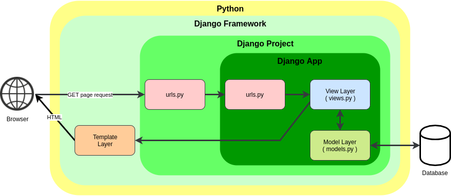
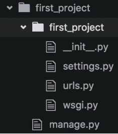
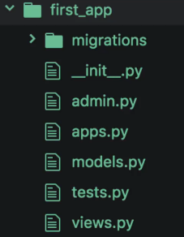

# **Django Set Up(Window)**
<br />

## Install pip
<br />

You'll need to make sure you havce the lastest version of pip installed

```
py -m pip install --upgrade pip
```
## Install Virtual Environment
<br />

```
py -m pip install --user virtualenv
```
## Create Virtual Environment
<br />

```
py -m venv env
```
## Activate Virtual Environment
<br />

After your virtual environment has been created, run this command:

```
.\env\Scripts\activate
```

As long as your virtual environment is activated, pip will install packages into that specific environment 

## Required Module
<br />
 
To install required modules for django, run this **INSIDE** of the virtual environment:

```
pip install -r requirements.txt
```

##  Get settings.py
<br />

Open discord server and copy the settings.py file into the project file 

## Connect Database
<br />

Enter database credentials and refer to DATABASES dictionary in settings.py and set up your connection to postgres

[Django database connection documentations](https://docs.djangoproject.com/en/4.0/ref/settings/#databases)


## Finish Setting Up Django
<br />

After the connection is made, run the following commands to migrate and run server:

```
python manage.py migrate
python manage.py runserver
```

Once you run the server, a similar prompt should appear in the terminal

```
System check identified no issues (0 silenced).<br>
March 02, 2022 - 00:05:24<br>
Django version 4.0.3, using settings 'ctrlIntell_project.settings'<br>
Starting development server at http://127.0.0.1:8000/<br>
Quit the server with CTRL-BREAK.
```

Now you can open up your web browser and go to the following address

```
localhost:8000
```

# **Django Framework** 
<br />

A Django Project is a collection of applications and configurations that when combined together will make up the full web application

A Django Application is created to perform a particular functionality for your entire web application. For instance, you could have a registration app, a polling app, comments app, etc.

These Django Apps can then be plugged into other Django Projects, so you can reuse them!



## Django Project

When you install Django, it actually also installed a command line tool called:
```
django-admin
```
To create the project Rune:
```
django-admin startproject first_project
```
You will then get something that looks like this:<br>



### **\_\_init\_\_.py**
This is a blank python script that due to its special name let Python know that this directory can be treated as a package.

### **settings.py**
This is where you will store all your project settings.

### **urls.py**
This is a Python script that will sotre all the URL patterns for your project. Basically the different pages of your web application.

### **wsgi.py**
This is a Python script that acts as the Web Server Gateway Interface. It will later on help you deploy your web app to production.

### **manage.py**
This is a Python script will be associates with many commands as you build your web app.

## Django Application
To create a simple application, you can run:

```
python manage.py startapp first_app
```


### **\_\_init\_\_.py**
This is a blank python script that due to its special name let Python know that this directory can be treated as a package

### **admin.py**
You can register your models here which Django will then use them with Djago's admin interface.

### **apps.py**
Here you can place application specific configurations.

### **models.py**
Here you can store the application's data models.

### **tests.py**
Here you can store test functions to test your code.

### **views.py**
This is where you have functions that handle requests and return responses. Each view will exist within the views.py file as its own individual function. Each view will also take in at least 1 arguments and return a HttpResponse object. To see the view, you need to map the view to the urls.py in the project file.

### **Migrations Folder**
This directory stores database specific information as it relates to the models.

### **Application Implementation**

After creating the application, you need to tell django that our application actually exist

Refer to INSTALLEDAPPS in settings.py and add you application


## URL Mappings
1. Direct mapping from views.py to urls.py


